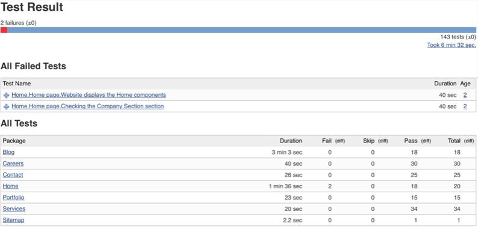
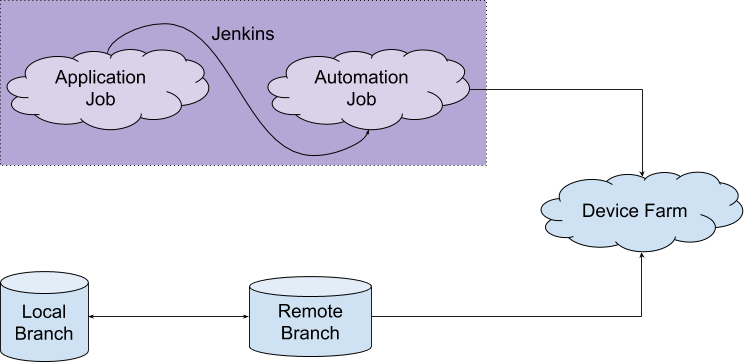
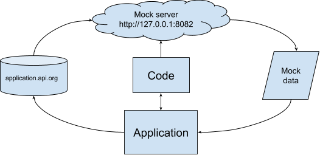
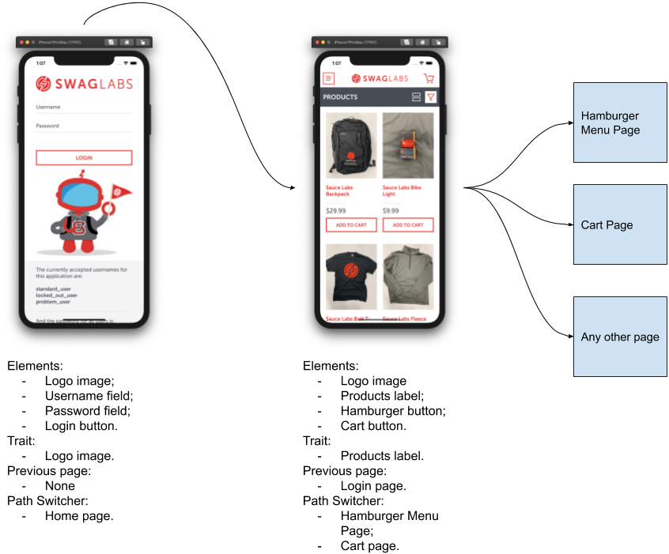

# Python Automation

Python Automation is a generic multiplatform test automation structure.

Features:
* Parallel testing;
* Cross-browser testing;
* Cross-platform testing;
* Mobile Native and Web Application testing;
* Open Source;
* Free;
* Mock server;
* Low Level of Maintenance.

The framework consists in:

* [Behave](https://github.com/behave/behave): Cucumber implementation in python;
* [Selenium](https://selenium-python.readthedocs.io/): Run Automation for web applications;
* [Appium](http://appium.io/docs/en/about-appium/api/): Run Automation for web/mobile native applications;
* [Flask](https://flask.palletsprojects.com/en/1.1.x/): Mock server solution.

# Table of Contents

<!--ts-->
* [Python Automation](#python-automation)
* [Table of Contents](#table-of-contents)
* [Installation](#installation)
    * [Environment Setup](#environment-setup)
    * [Manually](#manually)
* [Tech Details](#tech-details)
    * [Pages](#pages)
    * [Locators](#locators)
    * [Run Automation](#run-automation)
    * [Continuous Integration](#continuous-integration)
        * [Jenkins Integration Example](#jenkins-integration-example)
    * [Mock Server](#mock-server)
* [Get Started](#get-started)
    * [Configuring the Project](#configuring-the-project)
        * [Mobile Native Application](#mobile-native-application)
        * [Web Application](#web-application)
    * [Creating a new Step](#creating-a-new-step)
    * [Creating a new Page](#creating-a-new-page)
* [Appendix](#appendix)
    * [Element Inspection](#element-inspection)
<!--te-->

# Installation

* [Environment Setup](#environment-setup)

* [Manually](#manually)

## Environment Setup

In order to use simulators you will need to have the following IDEs installed

### Xcode

If you do not have it installed, you can download it from AppStore or [developer.apple.com](https://developer.apple.com)

### Android Studio

If you do not have it installed, you can download it from [developer.android.com](https://developer.android.com/studio)

## Manually
### Python Setup

First, you'll need Python 3 to use this project. You can get it easily with brew:

```$ brew install python3```

Depending on your environment, the symlinks ```brew``` creates can be different. It's commonly `python` or `python3`. To know which one is the correct one, just run these commands followed by ```--version```, and check if the version is > 3.6. Then just use the one that has a 3.x as your default one.

```$ python --version```

```$ python3 --version```

> :warning: In case your version is 2.7, that's the default MacOS version, and it WON'T RUN the automation. In this case, try going to the [python official download page](https://www.python.org/downloads/) and follow the tutorial there.

#### pip

Just follow the instructions on this link https://pip.pypa.io/en/stable/installing/

### Dependencies Setup

#### Setup virtual environment
If you don't have virtualenv installed in your machine, run the following command:

```$ pip install virtualenv```

This will make sure the dependencies are installed at the project level and prevent issues with system wide installations.

```$ virtualenv automation_virtualenv```

Before installing dependencies, we need to activate the `virtualenv` by running:

```$ source automation_virtualenv/bin/activate```

#### Requirements

To install the dependencies, just run:

```$ pip install -r requirements.txt```

If you created a virtualenv, it will install only on it. Otherwise, it will install in your system. In some cases, the installation may fail, recomending you to run with `--user`. Just run `$ pip install --user -r requirements.txt`.

#### Create Device Config File

On terminal (from `core_files` folder), just run:

```$ python support/generator/generate_devices_config.py```

This command will update the file ```resources/device_config.json```, that contains all information needed for the device capabilities.

**Note:** for now this command only updates the capabilities for iOS device simulators.

### Appium Setup

To install the Appium server, you'll need ```npm```, which comes with the ```node``` brew package:

```$ brew install node```

After that run:

```$ npm install -g appium```

#### Appium Doctor

Appium also needs some dependencies to work. I won't cover all of them (since there are a lot of dependencies), but to see if you have any environments issues, you just need to run ```appium-doctor```, which you can get with:

```$ npm install -g appium-doctor```

# Tech Details

## Pages

Every page object **must have** the following pre-requisites:

- Must inherit the [`BasePage`](core_files/support/pages/base.py) class before any other class.
- Must inherit the [element classes](core_files/support/elements/) that the page is gonna use, otherwise it won't have valid methods to execute on the steps.
- Should call `super().__init__(context)` on it's constructor.
- Should define a `locator` object on it's constructor, and it should have valid locator dictionaries.
- Should have a `navigate()` method defined, which will execute actions on other pages to reach your page.
- Should have a `page_is_displayed()` method defined, and the same should verify that a unique element is appearing on the screen.

## Locators

Locators should always have a dictionary of locators for each element you're testing. Element is the class that's responsible to handle it. The queries of this class should be the name
that will match the step call (these keys are the parameters), and the value should be `'ios'`, `'android'` and `'web'` as locators.

In `By.SOMETHING`, the `By` stands as an abreviation of `MobileBy`, which is a function imported from `appium.webdriver.common.mobileby`. While `SOMETHING` stands for the way or tool it will use to locate the given string.

The `Element Name` is the name that will be used to refer to this element when writing test scenarios. When the program reads `Element Name` in the scenario, it will understand that it's trying to search for an element with `name='Element Name'`.

The `Element.type`, as the name suggests, is the kind of that element. So for example it might be an `image`, `label`, `button`, `section` and so on.

Example:

```python
ELEMENT_NAME = Element.type(
    name='Element Name',
    ios_query=(By.ACCESSIBILITY_ID, 'Matches'),
    android_query=(By.ANDROID_UIAUTOMATOR, get_text('Matches')),
    web_query=(By.ID, 'Matches')
)
```

## Run Automation
All devices' names should be configured on: [device_config.json](core_files/resources/device_config.json).

[Python Virtual Environment](#setup-virtual-env) is mandatory to run the code, don't miss this configuration.

### Run the automation code
Firstly, make sure you're on `core_files` folder. Then run:

`$ python runner.py --d deviceName1,deviceName2`

If you want to run Web Automation:

`$ python runner.py --d deviceName1,deviceName2 --web`

### Tagging expression
If you want run the automation of a specific tag, then run:

`$ python runner.py --d deviceName1,deviceName2 --tag automation,ios`

## Continuous Integration

This project is configured to provide JUnit reports in XML by default.

After execution, the reports are stored on [reports](core_files/reports). They are divided by the each feature file and by device name.

There is an example of how Jenkins presents the reports:



### Jenkins Integration Example

In case of Mobile Native Application, the project can be a Jenkins job similar as the Application job. The Automation job need to be the down-stream job of the Application job. Also, the test automation project should have the latest build to test the application.

We should configure it via shell script saying that Jenkins will need to make a copy/paste to drag and drop the latest build into the [apps](core_files/resources/apps) folder.

There is an example of how Jenkins can handle the test automation solution inside the continuous delivery:



It's essential to have the latest version of the develop branch on Jenkins server. So, every new build executed by the Application job will execute the Automation job, copy/paste the new Application build and then run the tests.

## Mock server
During the tests, there are some situations that we need to have some pre-defined data.

For example:
- Test how the app presents the X screen without Y section;
- Test how the app presents the Z tab without something happening.

To solve this problem, we're using a mock server solution. This project uses the [Flask](https://flask.palletsprojects.com/en/1.1.x/) package as proxy tool that save all data for the first time and then uses the stored data for the next requests.

There is an example explaining how the test automation interact with the mock server solution and the app data:



We can configure the URL that the mock server will use to collect the data on [`app_config.yaml`](core_files/resources/app_config.yaml) by editting the `forwardToServer` variable.

All data will be stored on [`server_mock`](core_files/server-mock) folder.

The automation project run the mock server once started, and then, the Application will start using the stored data. It's necessary to map the API endpoint remotely to the mock server URL: http://127.0.0.1:8082 or change the Application API to request all data to mock server's URL.

Each test scenario assigned to the test automation can have a mock server environment to run. The mock server solution has the ability to handle mock server environments by variants. The environments are used to manage different data in different test environments.

Every new data stored on [`server_mock`](core_files/server-mock) will have the following format as default:

```GET.http```

To create a new version of this specific request, we can copy/paste this file and rename as following:

```GET(ENV_VARIABLE).http```

In this case, the `ENV_VARIABLE` is the name of the mock server environment that will be set on the test scenarios.

There is an example of the mock server environment assignment:

```gherkin
    @automation @default
    Scenario: App displays Matches header components
        Given the app displays the "Matches" screen
        Then the app should display the "Matches" label
            And the app should display the "Live Now" tab
            And the app should display the "Following" tab
            And the app should display the "All Matches" tab
```

# Get Started

## Configuring the project
>With the devices configured properly, we can run the test automation for native mobile applications with the Get Started example that's already configured on the project. Enjoy!

### Native Mobile Application
Firstly, you need to put the .apk and .ipa files in the [apps](core_files/resources/apps) folder.

Configure the application capabilities on [app_config.yaml](core_files/resources/app_config.yaml), you'll need to substitute all the information.

The [device_config.json](core_files/resources/device_config.json) file should be configured with the correct device information.

Check the following example for iOS and Android devices:

<details>
  <summary>Android</summary>

```json
    {
        "name": "personal-real",
        "deviceName": "0047503804",
        "platformName": "android",
        "udid": "0047503804",
        "automationName": "UIAutomator2",
        "platformVersion": "9"
    },
```
</details>

<details>
<summary>iOS</summary>

```json
    {
        "name": "PAP302-real",
        "deviceName": "PAP302",
        "platformName": "ios",
        "udid": "00008020-0011515C369A002E",
        "automationName": "XCUITest",
        "platformVersion": "12.0"
    },
```
</details>

### Web Application
Configure the URL of the Web Application on `address` property at the [app_config.yaml](core_files/resources/app_config.yaml) file and remove `app` property.

>`app` and `address` are both optional because they should not be added on the same platform. So, you'll need to replace these properties accordingly to the automation type.

The [device_config.json](core_files/resources/device_config.json) file should be configured with the correct device's information.

Check the following example for iOS, Android and Desktop devices:

<details>
  <summary>Android</summary>

```json
    {
        "name": "personal-real",
        "deviceName": "0047503804",
        "platformName": "android",
        "udid": "0047503804",
        "automationName": "UIAutomator2",
        "platformVersion": "9",
        "browserName": "Chrome"
    },
```
</details>

<details>
<summary>iOS</summary>

```json
    {
        "name": "PAP302-real",
        "deviceName": "PAP302",
        "platformName": "ios",
        "udid": "00008020-0011515C369A002E",
        "automationName": "XCUITest",
        "platformVersion": "12.0",
        "browserName": "Safari"
    },
```
</details>

<details>
<summary>Desktop</summary>

```json
    {
        "name": "chrome-mac",
        "platformName": "web",
        "browserName": "chrome",
        "version": "83.0"
    },
```
</details>

>Don't forget to run the code with `--web` flag (see [Run Automation](#run-automation)) in case of Web automation.

## Creating a new Step
Every new scenario that don't follow a pre-defined step must be implemented on [steps](core_files/features/steps) folder. Essentially, the files are divided by general steps and specific steps. Every new step that is really specific for a page need to be implemented on a specific step file.

For example:
```gherkin
    When the user types his credentials
```

This step is implemented in [login_steps.py](core_files/steps/login_steps.py):
```python
@when("the user types his credentials")
def type_credentials(context):
    page = LoginPage(context)
    assert page.is_current_page, f"{page} is not current page"
    page.type_credentials(context.user)
```

## Creating a new Page
There are some steps to follow for a new Page creation:

Firstly, we need to create the Page file on the [pages](/core_files/pages) folder. The page's structure need to follow a pattern (see [Pages](#pages) section), you can copy/paste an example of any other existing page.

The class name should follow the format: `PageNamePage` (considering that the name is: "Page Name").

The Elements should be created following the pattern described on [Locators](#locators) section. It's essential to create friendly internal identifiers to refer each element.

>Tip: the internal identifiers can be the same of the locator IDs, it will help to keep the automation with low level of maintenance.

With all Elements, we can configure the `trait` method to return the element that will be responsible to say that the page is displayed.

The `previous_screen` method should be configured returning the page that preceeds the current page.

```python
    @property
    def previous_screen(self):
        from pages import LoginPage
        return LoginPage(self.context)
```

The `path_switcher` method should be configured with the actions that the Application will perform to navigate to the next pages. It's essential to create a new method (i.e. `log_in_default_user`) to perform the action using the `BasePage` file. So, in this case, to access the `HomePage`, the application need to login in with valid credentials.

```python
    @property
    def path_switcher(self):
        from pages import HomePage

        paths = {
            HomePage: self.log_in_default_user
        }

        return paths
```

Check the following diagram to better understand how the pages work together:


To finish the page creation, we should configure the [__init__.py](/core_files/pages/__init__.py) file with the ClassName and the Filename of the new page.

# Appendix

## Element inspection
1. Using Appium UI inspector
    1. Installing Appium UI
            - Download and install [Appium UI](http://appium.io)
    1. Executing Appium UI:
        1. Open Appium UI
        1. Click on "Start Server" button
        1. On the top right corner, tap over the "Start Inspector Session" button
        1. On the Automatic Server tab, set the [desired capabilities](#desired-capabilities) for Android or iOS devices
        1. Click on "Start Session" button
        1. Inspect Elements:
            1. On the Appium Inspector window, you should be able to see the screen of the app
            1. Select any element on the screen to inspect their characteristics
            1. IMPORTANT: navigate on the app ONLY through the Appium Inspector. When needed to access another screen, click over the element on the Appium Inspector and, on the "Selected Element" window, use the "tap" command.
1. Accessibility Inspector (iOS only)
    1. Open Accessibility Inspector
            - Need to have Xcode installed.
    1. Access your device
        1. Plug the mobile device to your computer
        1. On the top left corner of the open window, select the desired device
        1. On the top left corner of the open window, next to the device name, select "All processes"
        1. On your device, launch the application that you intend to inspect
        1. Inspect Elements:
            1. On the Accessibility Inspector window, the forth symbol from right-to-left on the top right corner. Tap over the `Start Inspection Follows Point` symbol.
            1. Then on your application, tap over the element you wish to inspect
            1. The Accessibility Inspector should give all the information regarding that element
1. UIAutomator Viewer (Android only)
    1. Executing Uiautomator Viewer
        1. Plug the mobile device to your computer
        1. On your terminal, make sure you're on the users directory
        1. Then type ```$ cd your_path_to_android_sdk/tools/``` and press Enter
        1. The type ```$ uiautomatorviewer``` and press Enter
        1. Inspect App Elements:
            1. With the UIautomator Viewer open, tap over `Device Screenshot` button
            1. A image from the app should be visible and it should be possible to select and inspect each element from the app screen

### Desired Capabilities
<details>
  <summary>Android</summary>

```json
            {
                "platformName": "Android",
                "platformVersion": "VersionNumber",
                "deviceName": "DeviceName",
                "udid": "DeviceUdID",
                "app": "/Users/username/project_name/core_files/resources/apps/android_app.apk",
                "appPackage": "com.app.package",
                "appActivity": "com.arctouch.MainActivity",
            }
```
</details>

<details>
<summary>iOS</summary>

```json
            {
                "platformName": "iOS",
                "platformVersion": "VersionNumber",
                "deviceName": "DeviceName",
                "automationName": "XCUITest",
                "app": "/Users/username/project_name/core_files/resources/apps/ios_app.ipa",
                "udid": "DeviceUdID",
                "xcodeOrgId": "5HMJW6N276",
                "xcodeSigningId": "iPhone Developer",
                "bundleIdentifier": "com.bundle.id"
            }
```
</details>

## Android packages

- Java: https://www.oracle.com/java/technologies/javase/javase-jdk8-downloads.html
- Android SDK: https://developer.android.com/studio

## iOS packages

- Carthage:
```brew install carthage```
- Appium setup for Real Devices: http://appium.io/docs/en/drivers/ios-xcuitest-real-devices/
